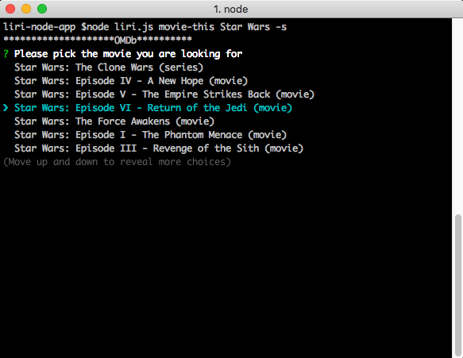

# liri-node-app

liri-node-app is a command line tool to access various APIs. It supports searching titles on the OMDb API, retrieving recent tweets made by you and those you follow, and searching the Spotify API for tracks.



## Commands

```
movie-this <movie-name>: 
	Searches for the closest title match to given movie 
	and displays the details about the movie
	
	Options: 
		-search -s 
			Provides a list of search results related to given title
			to choose from and displays details of choice
```
```
spotify-this-song <song-name>:
	Searches Spotify for given song, provides a list of results
	and gives album, artist, and preview link details for choice
```
```
my-tweets: 
	Provides last twenty tweets by the user provided
	as well as those the user follows
```
```
do-what-it-says: 
	Looks for a random.txt file and runs the commands found on each new line in the file
	Note: Expects each command to be on a seperate line
```

## Usage

This project relies on API keys provided in a .env file in the following format:

```
# Spotify API keys

SPOTIFY_ID=KEY_HERE
SPOTIFY_SECRET=KEY_HERE

# Twitter API keys

TWITTER_CONSUMER_KEY=KEY_HERE
TWITTER_CONSUMER_SECRET=KEY_HERE
TWITTER_ACCESS_TOKEN_KEY=KEY_HERE
TWITTER_ACCESS_TOKEN_SECRET=KEY_HERE

#OMDb API key

OMDB_KEY=KEY_HERE
```
